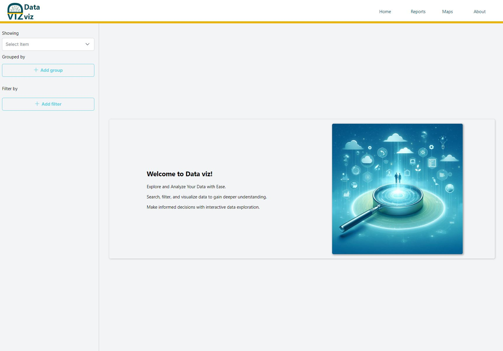

# DataViz App

This application retrieves data from the Data USA API and presents it in a user-friendly format. Data visualizations include charts and tables, allowing users to explore the information in their preferred format. Additionally, users can filter and stratify the data to focus on specific areas of interest.

# Copyright

Data Disclaimer: The data presented in this application is sourced from Data USA and remains their intellectual property. For information on data usage and attribution, please refer to Data USA's terms of service.

© 2024 Byteous. Developed by Negar Maleki with supervision from Payam Alexander. This application is free to use.

# APP User Manual

- [Main User Interface](#Main_User_Interface)
- [Select Measure of interest](#Select_Measure_of_interest)
- [Select Groupings Variables](#Select_Groupings_Variables)
- [View Various Charts](#View_Various_Charts)
- [Filter Grouping Cuts](#Filter_Grouping_Cuts)
- [Filter Data by Measures](#Filter_Data_by_Measures)
- [Maximized Chart View](#Maximized_Chart_View)

### Main User Interface

The main interface allows users to customize their data exploration experience. They can choose how to group data (by clicking the buttons at the top) and filter it using the dropdown menus on the left.

### Select Measure of interest

A dropdown menu helps you focus your exploration on a particular aspect of the data. A powerful search bar lets you quickly find the outcomes you're interested in, streamlining your analysis.

### Select Groupings Variables

This option lets you segment the data by one or more variables. This allows you to compare the measure of interest across different categories within your data, revealing trends or patterns.

### View Various Charts

Based on your chosen measure and groupings, the application automatically generates various charts to visually represent the data. You can download these charts for further analysis or view them maximized for a clearer picture.

### Filter Grouping Cuts

The "Filter Grouping Cuts" section provides additional refinement. You can further narrow down the data within each grouping by selecting specific subsets. This allows you to zoom in on specific areas of interest within your chosen groups.

### Filter Data by Measures

This option offers another way to refine your analysis. You can filter the data based on the values of other measures, potentially highlighting specific data points or trends based on additional criteria.

### Maximized Chart View

Each chart may be viewed in a maximized window for a clearer picture.

